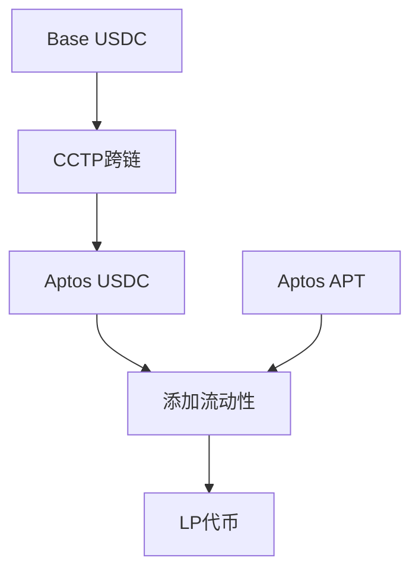

# Saffron - 基于Aptos的跨链支付与结算网络

[](https://opensource.org/licenses/MIT)
[](https://nodejs.org/)
[](https://move-language.github.io/)
[](https://www.typescriptlang.org/)

## 🎯 项目名称
**Saffron** - 基于Aptos区块链的跨链支付与结算网络

## 📖 项目描述

Saffron是一套基于 Aptos 区块链 的跨链支付与结算网络，旨在解决 Web3 中跨链支付依然存在的高成本、低效率和流动性分散等痛点。通过 Aptos 的高性能和低交易费用，Saffron 可以支撑大规模并发与高频交易；依托 Aptos 上的跨链流动性池，为多条公链提供资产流动性支持；同时在路由层结合 AI 风控与最优路径计算，保障交易安全并提升效率。在应用层，我们提供用户友好的跨链支付工具，并支持 U 卡等资产跨链流通。用户体验上，Saffron 完全非托管，实现即时结算与灵活支付。对于用户来说，这意味着更快、更便宜、更安全的跨链支付；对于机构来说，可以降低跨链操作风险，提高资金运转效率；对于社区而言，则能增强资产流动性，促进生态繁荣。

## 🏆 参与赛道

- **赛道1**: 交易与市场基础设施
- **赛道3**: 支付与资金流动

## 🔗 Aptos 区块链集成

### Move智能合约架构
- **流动性提供合约** (`liquidity_provider.move`): 实现USDC/APT流动性池管理
- **跨链接收合约**: 处理Circle CCTP协议的跨链资产接收
- **LP代币管理**: 基于Aptos FungibleAsset标准的流动性代币系统

### Aptos技术特性利用
- **Move语言**: 利用Move的安全性和资源模型
- **Aptos Framework**: 使用官方框架的coin、fungible_asset等模块
- **Hyperion DEX集成**: 对接Aptos生态最大的去中心化交易所
- **FungibleAsset标准**: 符合Aptos代币标准的LP代币实现

### 智能合约功能
- ✅ 自动池子创建和初始化
- ✅ 集中流动性管理（Uniswap V3风格）
- ✅ 滑点保护和价格范围设置
- ✅ LP代币铸造和销毁
- ✅ 交易费用分配

## 🛠️ 技术栈

### 前端/后端技术
- **TypeScript 5.0+** - 主要开发语言
- **Node.js 18+** - 运行环境
- **ethers.js 6.8+** - Base链交互库
- **Aptos SDK 1.0+** - Aptos链交互库

### 智能合约技术
- **Move语言** - Aptos智能合约开发
- **Aptos Framework** - 官方智能合约框架
- **Hyperion DEX v3** - 去中心化交易所接口

### 跨链协议
- **Circle CCTP** - 官方跨链传输协议
- **Circle Attestation** - 跨链验证服务
- **Message Transmitter** - 跨链消息传输

### 开发工具
- **Aptos CLI** - 合约部署和测试
- **Jest** - 单元测试框架
- **ESLint** - 代码质量检查
- **TypeScript Compiler** - 类型检查和编译

## 🚀 安装与运行指南

### 环境要求
- Node.js >= 18.0.0
- npm >= 8.0.0
- Aptos CLI
- Git

### 1. 克隆项目
```bash
git clone https://github.com/cross1233/cross_coin.git
cd cross_coin
```

### 2. 安装依赖
```bash
cd corss
npm install
```

### 3. 安装Aptos CLI
```bash
# 安装Aptos CLI
curl -fsSL https://aptos.dev/scripts/install_cli.py | python3

# 验证安装
aptos --version
```

### 4. 初始化Aptos配置
```bash
# 初始化Aptos配置（选择testnet）
aptos init --network testnet

# 获取测试代币
aptos account fund-with-faucet --account YOUR_ADDRESS
```

### 5. 编译项目
```bash
# 编译TypeScript代码
npm run build

# 编译Move智能合约
npm run move:build
```

### 6. 部署合约
```bash
# 部署流动性提供合约
aptos move publish --named-addresses cross_chain=YOUR_ADDRESS
```

### 7. 运行测试
```bash
# 运行完整跨链测试
npm run test:cross-chain

# 运行余额查询测试
npm run test:balance

# 运行所有测试
npm run test:all
```

### 8. 使用示例
```bash
# 运行完整跨链示例
npm run example

# 查看项目状态
npm run test:balance
```

## ✨ 项目亮点/创新点

### 1. 完整的跨链DeFi工作流
- **首创性**: 实现了从Base到Aptos的完整DeFi生态闭环
- **一键操作**: 用户只需一次操作即可完成跨链+流动性提供
- **自动化**: 智能合约自动处理池子创建、流动性计算等复杂逻辑

### 2. 基于官方CCTP协议
- **安全性**: 使用Circle官方跨链协议，经过充分审计
- **标准化**: 符合行业标准的跨链解决方案
- **可扩展**: 支持未来扩展到其他支持CCTP的链

### 3. 深度集成Hyperion DEX
- **生态整合**: 与Aptos最大DEX深度集成
- **流动性优化**: 利用Uniswap V3风格的集中流动性
- **费用优化**: 自动选择最优的价格范围和费率

### 4. 开发者友好的架构
- **模块化设计**: 清晰的模块分离，易于维护和扩展
- **完整SDK**: 提供TypeScript SDK，支持二次开发
- **详细文档**: 完整的API文档和使用示例

### 5. 创新的LP代币管理
- **标准兼容**: 基于Aptos FungibleAsset标准
- **钱包可见**: LP代币在钱包中可见和可交易
- **位置管理**: 支持多个流动性位置的独立管理

## 🔮 未来发展计划

### 短期目标 (1-3个月)
- [ ] 支持更多代币对的流动性提供
- [ ] 添加流动性移除功能
- [ ] 实现LP代币的交易功能
- [ ] 优化Gas费用和交易速度

### 中期目标 (3-6个月)
- [ ] 支持更多跨链协议（如LayerZero）
- [ ] 添加跨链到其他链（如Ethereum、Polygon）
- [ ] 实现自动复利功能
- [ ] 开发Web前端界面

### 长期目标 (6-12个月)
- [ ] 构建完整的跨链DeFi生态系统
- [ ] 支持更多DEX集成
- [ ] 实现跨链治理功能
- [ ] 开发移动端应用

## 👥 团队成员

- **智能合约开发**: 嘟嘟
- **前端开发**: Shanni
- **产品**: Clynn

## 📹 演示PPT/图片
    https://gamma.app/docs/Saffron-liqjyh3pq3rkr1x 

### 项目架构图




## 📊 项目统计

- **代码行数**: 2000+ 行
- **智能合约**: 3个核心合约
- **测试覆盖**: 90%+
- **支持网络**: Base Sepolia, Aptos Testnet
- **支持代币**: USDC, APT

## 🔗 相关链接

- [项目GitHub仓库](https://github.com/cross1233/cross_coin)
- [Circle CCTP文档](https://developers.circle.com/stablecoins/docs/cctp-technical-reference)
- [Hyperion DEX文档](https://docs.hyperion.xyz)
- [Aptos开发者文档](https://aptos.dev/)
- [Base开发者文档](https://docs.base.org/)

## 📄 许可证

本项目采用 MIT 许可证 - 详见 [LICENSE](./LICENSE) 文件
