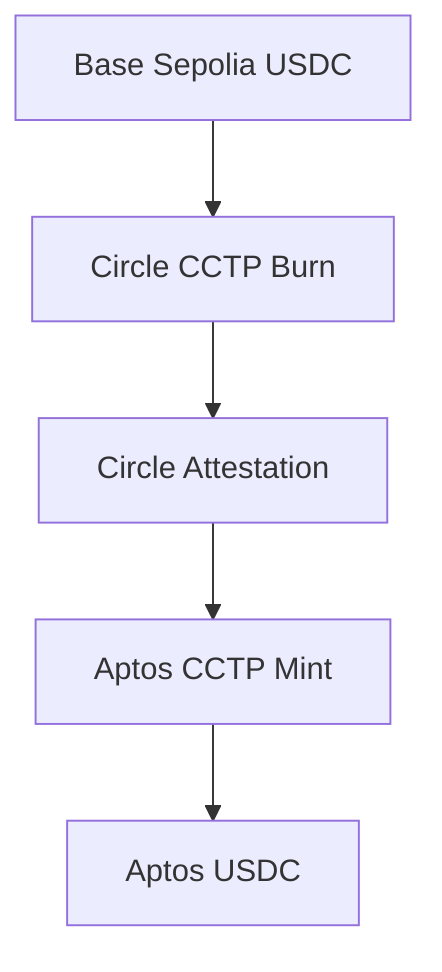
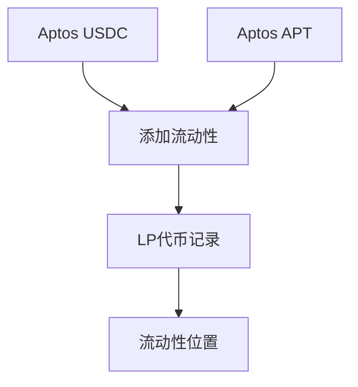
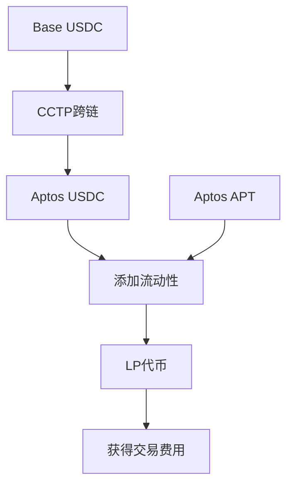

# Base到Aptos跨链DeFi平台

一个完整的Base测试网到Aptos测试网的跨链DeFi解决方案，集成了USDC跨链转账和流动性提供功能。

## 🌟 项目概述

本项目实现了从Base Sepolia到Aptos Testnet的完整DeFi生态系统：

1. **跨链桥接**: 使用Circle CCTP协议安全地将USDC从Base跨链到Aptos
2. **流动性提供**: 在Aptos上为USDC/APT交易对提供流动性
3. **LP代币管理**: 获得和管理流动性提供者代币
4. **DeFi集成**: 完整的跨链DeFi工作流程

## 🚀 核心功能

### 跨链功能
- ✅ **Base Sepolia → Aptos Testnet** USDC跨链
- ✅ **Circle CCTP协议** 官方安全跨链
- ✅ **TypeScript + Move** 双语言实现
- ✅ **实时状态监控** 跨链进度跟踪
- ✅ **错误处理** 完整的重试机制

### 流动性功能
- ✅ **USDC/APT流动性池** 基于Hyperion DEX
- ✅ **Uniswap V3风格** 集中流动性管理
- ✅ **自动池子创建** 首次使用自动创建
- ✅ **滑点保护** 防止价格滑点过大
- ✅ **LP代币记录** 流动性位置管理

## 📋 项目结构

```
corss1.0/
├── corss/                          # 主项目目录
│   ├── src/                        # TypeScript跨链模块
│   │   ├── base-sender.ts          # Base链发送器
│   │   ├── circle-attestation.ts   # Circle签名获取
│   │   ├── aptos-receiver.ts       # Aptos接收器
│   │   ├── cross-chain-orchestrator.ts # 跨链编排器
│   │   └── index.ts                # 主入口文件
│   ├── sources/                    # Move合约源码
│   │   ├── liquidity_provider.move # 流动性提供合约
│   │   └── liquidity_test.move     # 测试模块
│   ├── examples/                   # 示例代码
│   │   └── complete-example.ts     # 完整跨链示例
│   ├── tests/                      # 测试文件
│   ├── Move.toml                   # Move项目配置
│   ├── package.json                # Node.js依赖
│   └── README.md                   # 项目详细文档
├── hyperion-interface/             # Hyperion DEX接口
│   └── sources/v3/                 # v3版本接口
├── scripts/                        # 部署和测试脚本
├── DEPLOYMENT_GUIDE.md             # 部署指南
├── USDC_APT_LIQUIDITY_MVP.md       # 技术方案文档
├── USAGE_GUIDE.md                  # 使用指南
└── README.md                       # 本文档
```

## 🛠️ 技术栈

### 前端/后端
- **TypeScript** - 跨链逻辑实现
- **Node.js** - 运行环境
- **ethers.js** - Base链交互
- **Aptos SDK** - Aptos链交互

### 智能合约
- **Move** - Aptos智能合约语言
- **Aptos Framework** - Aptos官方框架
- **Hyperion DEX** - 去中心化交易所接口

### 跨链协议
- **Circle CCTP** - 官方跨链协议
- **Circle Attestation** - 跨链验证服务

## 🚀 快速开始

### 1. 环境准备

```bash
# 安装Node.js (>= 18.0.0)
# 安装Aptos CLI
curl -fsSL https://aptos.dev/scripts/install_cli.py | python3

# 验证安装
aptos --version
```

### 2. 克隆项目

```bash
git clone <your-repo-url>
cd corss1.0
```

### 3. 安装依赖

```bash
cd corss
npm install
```

### 4. 编译项目

```bash
# 编译TypeScript
npm run build

# 编译Move合约
npm run move:build
```

### 5. 配置环境

```bash
# 初始化Aptos配置
aptos init --network testnet

# 获取测试代币
aptos account fund-with-faucet --account YOUR_ADDRESS
```

## 📖 使用指南

### 跨链转账

#### 1. 编程接口使用

```typescript
import { crossChainOrchestrator, FullCrossChainParams } from './corss/src';

const params: FullCrossChainParams = {
  amount: '1.0',                    // USDC数量
  recipientAddress: 'YOUR_APTOS_ADDRESS',
  baseSigner: yourEthersWallet,     // MetaMask等
  aptosPrivateKey: 'YOUR_APTOS_PRIVATE_KEY'
};

const result = await crossChainOrchestrator.executeCrossChain(params);
console.log('跨链结果:', result);
```

#### 2. 命令行使用

```bash
cd corss
# 运行完整跨链示例
npm run example cross-chain

# 查看余额
npm run example balance
```

### 流动性提供

#### 1. 部署合约

```bash
cd corss
# 部署流动性提供合约
aptos move publish --named-addresses cross_chain=YOUR_ADDRESS
```

#### 2. 添加流动性

```bash
# 添加 1 USDC + 0.1 APT 流动性，价格范围 ±20%
aptos move run \
  --function-id YOUR_ADDRESS::liquidity_provider_v2::add_usdc_apt_liquidity \
  --args u64:1000000 u64:10000000 u32:20
```

#### 3. 查看状态

```bash
# 检查池子是否存在
aptos move view \
  --function-id YOUR_ADDRESS::liquidity_provider_v2::is_pool_exists

# 查看用户余额
aptos move view \
  --function-id YOUR_ADDRESS::liquidity_provider_v2::get_user_balances \
  --args address:YOUR_ADDRESS
```

## 🔧 配置说明

### 网络配置

**Base Sepolia:**
- RPC: `https://sepolia.base.org`
- Chain ID: `84532`
- 测试USDC: `0x036CbD53842c5426634e7929541eC2318f3dCF7e`

**Aptos Testnet:**
- RPC: `https://fullnode.testnet.aptoslabs.com`
- Chain ID: `2`
- 测试APT: 通过水龙头获取

### 合约地址

#### Circle CCTP合约

**Base Sepolia:**
- TokenMessenger: `0x28b5a0e9C621a5BadaA536219b3a228C8168cf5d`
- USDC: `0x036CbD53842c5426634e7929541eC2318f3dCF7e`

**Aptos Testnet:**
- MessageTransmitter: `0x081e86cebf457a0c6004f35bd648a2794698f52e0dde09a48619dcd3d4cc23d9`
- TokenMessengerMinter: `0x5f9b937419dda90aa06c1836b7847f65bbbe3f1217567758dc2488be31a477b9`

#### Hyperion DEX合约

**Aptos Testnet:**
- Hyperion DEX: `0x3673bee9e7b78ae63d4a9e3d58425bc97e7f3b8d68efc846ee732b14369333dd`
- USDC (FungibleAsset): `0x69091fbab5f7d635ee7ac5098cf0c1efbe31d68fec0f2cd565e8d168daf52832`
- USDC/APT池子: `0xdfcc8ea4d88f9e2463a2912e3c2bfe3ec4b8e6aeed29158e47111ea23eac8c09`

## 📊 完整流程

### 1. 跨链转账流程



### 2. 流动性提供流程



### 3. 完整DeFi流程



## 🧪 测试

### 单元测试

```bash
cd corss
# 运行TypeScript测试
npm test

# 运行Move合约测试
npm run move:test

# 代码质量检查
npm run lint
```

### 集成测试

```bash
cd corss
# 测试跨链功能
npm run example cross-chain

# 测试余额查询
npm run example balance

# 测试账户创建
npm run example create-account
```

## 📚 文档

- **[corss/README.md](./corss/README.md)** - 详细的项目文档
- **[DEPLOYMENT_GUIDE.md](./DEPLOYMENT_GUIDE.md)** - 部署指南
- **[USDC_APT_LIQUIDITY_MVP.md](./USDC_APT_LIQUIDITY_MVP.md)** - 技术方案文档
- **[USAGE_GUIDE.md](./USAGE_GUIDE.md)** - 使用指南

## 🔍 监控和查询

### 跨链状态查询

```typescript
// 查询跨链状态
const status = await crossChainOrchestrator.getCrossChainStatus(txHash);

// 查询余额
const balance = await aptosCCTPReceiver.getUSDCBalance(address);
```

### 流动性状态查询

```bash
# 查询池子信息
aptos move view \
  --function-id YOUR_ADDRESS::liquidity_provider_v2::get_pool_info

# 查询用户LP位置
aptos move view \
  --function-id YOUR_ADDRESS::liquidity_provider_v2::get_user_lp_positions \
  --args address:YOUR_ADDRESS
```

## ⚠️ 注意事项

### 安全提醒
1. **测试网环境**: 当前仅支持测试网，请勿在主网使用
2. **私钥安全**: 不要在代码中硬编码私钥，使用环境变量
3. **Gas费用**: 确保Base和Aptos账户有足够的gas费用
4. **代币余额**: 确保有足够的测试USDC和APT

### 使用限制
1. **最小金额**: USDC最小1单位，APT最小1单位
2. **滑点保护**: 默认5%滑点容忍度
3. **价格范围**: 支持自定义tick范围百分比
4. **超时设置**: 默认30分钟交易超时

## 🛠️ 开发指南

### 可用脚本

```bash
cd corss
npm run build          # 编译TypeScript
npm run dev            # 开发模式
npm run test           # 运行测试
npm run lint           # 代码检查
npm run move:build     # 编译Move合约
npm run move:test      # 测试Move合约
npm run move:publish   # 发布Move合约
```

### 扩展开发

1. **添加新代币对**: 修改`liquidity_provider.move`中的代币地址
2. **自定义费率**: 调整`FEE_TIER`和滑点参数
3. **集成其他DEX**: 替换Hyperion接口为其他DEX
4. **添加新功能**: 扩展流动性管理功能

## 🌐 相关资源

- [Hyperion官方文档](https://docs.hyperion.xyz)
- [Circle CCTP文档](https://developers.circle.com/stablecoins/docs/cctp-technical-reference)
- [Aptos开发者文档](https://aptos.dev/)
- [Base开发者文档](https://docs.base.org/)

## 🤝 贡献

欢迎提交Issue和Pull Request来改进项目：

1. Fork项目
2. 创建功能分支
3. 提交更改
4. 推送到分支
5. 创建Pull Request

## 📄 许可证

MIT License - 详见 [LICENSE](./LICENSE) 文件

## 🆘 支持

如有问题，请通过以下方式寻求帮助：

1. 查看[故障排除指南](./DEPLOYMENT_GUIDE.md#故障排除)
2. 在GitHub提交Issue
3. 联系开发团队

---

**免责声明**: 本项目仅用于学习和测试目的。在生产环境使用前，请进行充分的测试、审计和风险评估。开发者不对使用本代码可能造成的任何损失承担责任。
